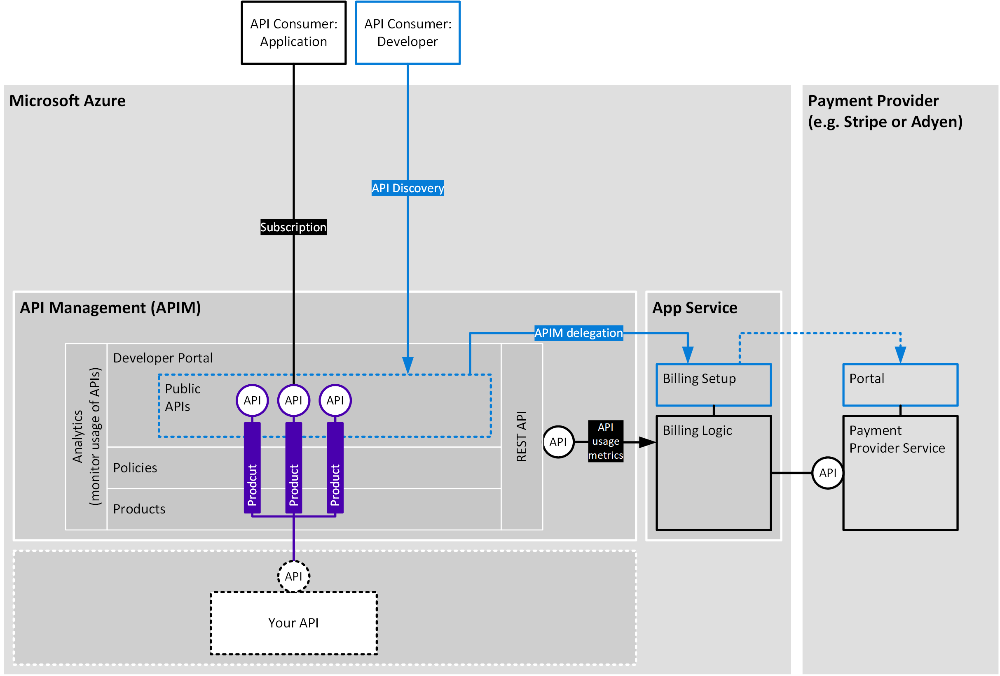

# Azure API Management - Monetization

This is a **demo project** providing two working examples of how to integrate Azure API Management (APIM) with payment providers - one based on integration with [Stripe](https://stripe.com/), the other with [Adyen](https://www.adyen.com/).

The objective is to show how you can enable consumers to discover an API that you wish to make public, enter their payment details in order to activate their subscription and trigger automated payment based on their usage of the API.

To use this demo, you will need to deploy the solution into your own Azure subscription and to set up your own Stripe / Adyen account.  This is **not** a managed service - you will be responsible for managing the resources that are deployed on Azure, adapting the solution to meet your specific use case and keeping the solution up to date.

Read the following documents to get further background and context:

| Document                                                                                              | Purpose 
|-------------------------------------------------------------------------------------------------------|--------------------------------------------------------------------------------------------------------|
| [how to think about monetization](./documentation/how-to-think-about-monetization.md)                   | Makes recommendations about how to design a successful monetization strategy for your API.             |
| [how APIM supports monetisation](./documentation/how-APIM-supports-monetisation.md)                     | Provides an overview of the APIM features that can be used to accelerate and de-risk API monetization. |


## Architecture

The following diagram illustrates the architecture for integrating API Management with a payment provider:




## Prerequisites for deploying demo

### Required tools

- [PowerShell](https://docs.microsoft.com/en-us/powershell/scripting/install/installing-powershell?view=powershell-7.1) - version 7.1 or later
- [Az CLI](https://docs.microsoft.com/en-us/cli/azure/install-azure-cli) - version 2.21.0 or later
- [NodeJS](https://nodejs.org/en/download/) - 

### Service Principal

In order to run the deployment, you will need a service principal set up in the AAD tenant that will be used by the Web App to update the status of APIM subscriptions. 

The simplest way to do this is using the Az CLI.

First, you need to [Sign in with Azure CLI](https://docs.microsoft.com/en-us/cli/azure/authenticate-azure-cli) by using the following command:
```
az login
```
Then you can [Create an Azure service principal with the Azure CLI](https://docs.microsoft.com/en-us/cli/azure/create-an-azure-service-principal-azure-cli) through the following command:

```
az ad sp create-for-rbac -n "<name-for-your-service-principal>" --skip-assignment
```

Take note of the appId (aka client ID) and password (aka client secret), as you will need to pass these values as deployment parameters.

For deployment, you will also need the object ID of the service principal you just created. To retrieve this use:

```
az ad sp show --id "http://<name-for-your-service-principal>"
```

The correct role assignments for the service principal will be assigned as part of the deployment.

## Deploying the demo

You can deploy the demo using either [Stripe](https://stripe.com/) or [Adyen](https://www.adyen.com/) as the payment provider. Follow the appropiate link below for the deployment steps for your selected provider.

- [Deploy with Stripe](./documentation/stripe-deploy.md)

- [Deploy with Adyen](./documentation/adyen-deploy.md)

## Further reading / next steps

- For more details about the resources that are deployed, see [Deployment Details](./documentation/deployment-details.md)
- More information on how the solution works:
  - [How to implement monetization with Azure API Management and Stripe](./documentation/stripe-details.md)
  - [How to implement monetization with Azure API Management and Adyen](./documentation/adyen-details.md)
- If you want to customize the demo, see [Advanced steps](./documentation/advanced-steps.md)


## Contributing

This project welcomes contributions and suggestions.  Most contributions require you to agree to a
Contributor License Agreement (CLA) declaring that you have the right to, and actually do, grant us
the rights to use your contribution. For details, visit https://cla.opensource.microsoft.com.

When you submit a pull request, a CLA bot will automatically determine whether you need to provide
a CLA and decorate the PR appropriately (e.g., status check, comment). Simply follow the instructions
provided by the bot. You will only need to do this once across all repos using our CLA.

This project has adopted the [Microsoft Open Source Code of Conduct](https://opensource.microsoft.com/codeofconduct/).
For more information see the [Code of Conduct FAQ](https://opensource.microsoft.com/codeofconduct/faq/) or
contact [opencode@microsoft.com](mailto:opencode@microsoft.com) with any additional questions or comments.

## Trademarks

This project may contain trademarks or logos for projects, products, or services. Authorized use of Microsoft 
trademarks or logos is subject to and must follow 
[Microsoft's Trademark & Brand Guidelines](https://www.microsoft.com/en-us/legal/intellectualproperty/trademarks/usage/general).
Use of Microsoft trademarks or logos in modified versions of this project must not cause confusion or imply Microsoft sponsorship.
Any use of third-party trademarks or logos are subject to those third-party's policies.